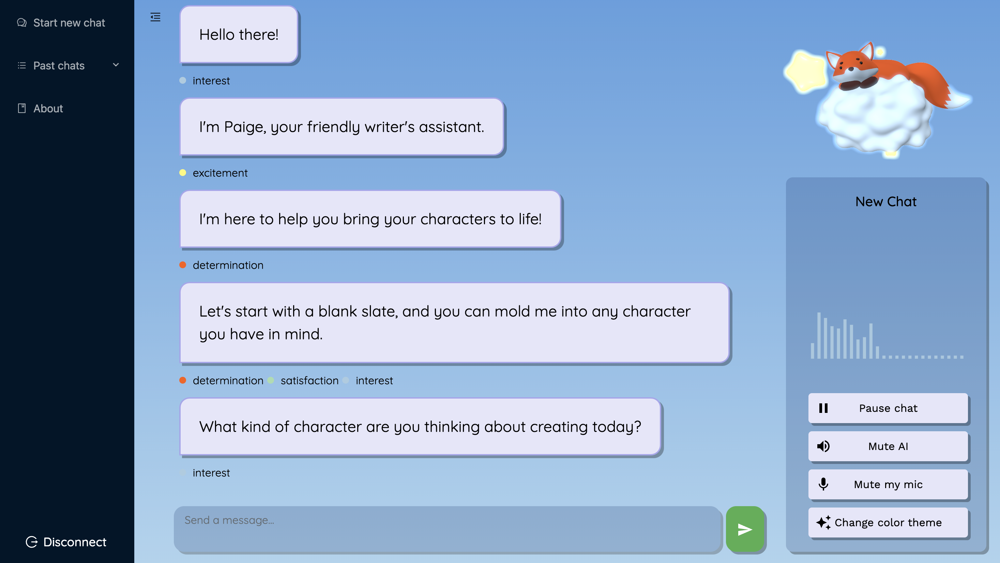
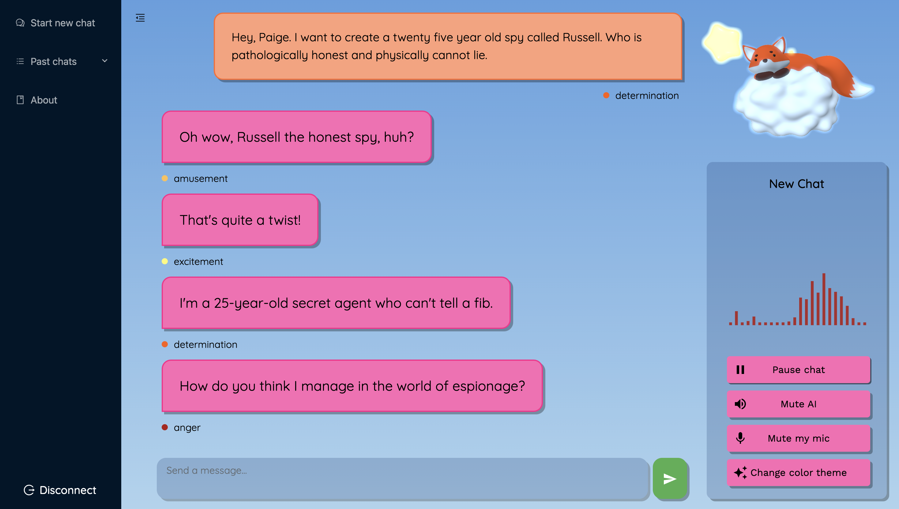
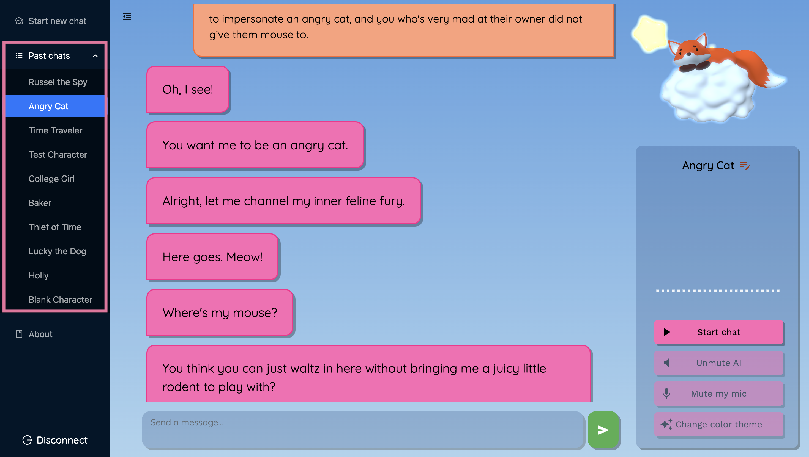
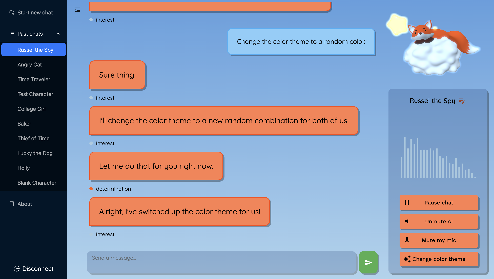

<div align="center">
  <h1>Inspiwrite</h1>
</div>

https://github.com/user-attachments/assets/1b1c4f25-2db6-45c2-9683-34e2eaa21d81

Inspiwrite is an interactive workshop space for writers to brainstorm
character ideas and bring them to life in voice-to-voice conversations.
Create unique characters, build their backstories, and explore their personalities through dynamic dialogues!  

## Installation

1. **Clone the repository:**  
    Make sure to replace `username` with your own GitHub username:  

    ```bash
    git clone https://github.com/username/inspiwrite.git
    ```

2. **In a code editor of your choice, navigate to the project directory:**
    ```bash
    cd inspiwrite
    ```

3. **Install required dependencies:**
    ```bash
    pnpm install
    ```
    If you haven't installed `pnpm` yet, running this command will result in a message indicating that the command was not found. In that case, you would need to install it first. Node.js can be installed from its [official website](https://nodejs.org/en/download/package-manager) or via a package manager like [Homebrew](https://brew.sh/), and `pnpm` can be installed via npm (which comes with Node.js) by running `npm install -g pnpm` in the terminal.

4. **Set environment variables for authentication:**  
    
    You'll need your Hume API key and Secret key which are accessible from the Portal. See Hume's documentation on [getting your api keys](https://dev.hume.ai/docs/introduction/api-key).

    There is an example file called [`.env.example`]. After obtaining your API keys, Create a `.env` file, copy/paste the contents of the `.env.example` file, and fill in your environment variables.

    ```sh
    VITE_HUME_API_KEY="<YOUR_API_KEY>"
    VITE_HUME_SECRET_KEY="<YOUR_SECRET_KEY>"
    ```

    Note the `VITE` prefix to the environment variables. This prefix is required for vite to expose the environment variables to the client. For more information, see the [vite documentation](https://vitejs.dev/guide/env-and-mode) on environment variables and modes.

## Serve Project
Below are the steps to run the project locally:
1. Run `pnpm i` to install required dependencies.
2. Run `pnpm build` to build the project.
3. Run `pnpm dev` to serve the project at `localhost:5173`.

## Features
### Character Creation
You are introduced to a writing assistant called Paige who starts as a blank slate character.
You can customize Paige by giving them a name, age, gender, occupation, backstory, and more.
Throughout the conversation, Paige will ask questions to help you brainstorm your character.
Additionally, you can ask Paige for suggestions on what the character might do in
certain scenarios to help fill in plot holes and develop your story idea.



### Interactive Dialogue
EVI, Hume AI's Empathic Voice Interface is used for dialogue.
EVI is a voice assistant with emotional intelligence that can detect changes in
emotions and embody the emotions of the character you are creating.
It serves as a first-person embodiment of your character, allowing you to explore
and workshop their personality.



### Saved Conversation History
Conversations are saved by fetching previous chat groups associated with your Hume API key.
To resume a conversation, simply click on a previous chat group from the "Chats" tab.
The associated `chat_group_id` will be provided as context in the VoiceProvider,
informing EVI's dialogue and allowing it to remember details from previous conversations.
You can also rename your previous conversations for easier association and reference.



> ℹ️ Note
> 
> If your project is experiencing issues fetching previous conversation history,
> you may have turned off data retention. If you'd like to save and
> access your previous conversations, make sure you've allowed data retention
> by going to the [Portal](https://platform.hume.ai/settings/profile).

### Color Customization
To make your workspace more fun and imaginative, you can customize the color of the interface.
Click the "Change Color Theme" button or directly ask EVI to change the assistant message color,
user message color, or entire color theme. Your selected color theme will be
saved and retained the next time you run the project. This color customization is
managed through EVI's user-defined tools, specified in a Session Settings message.


